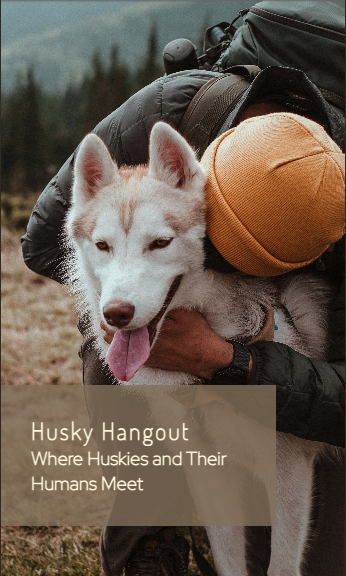
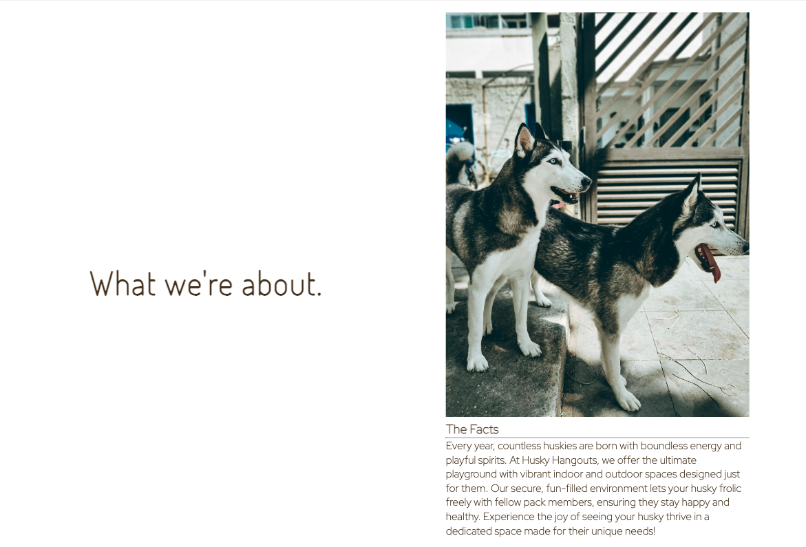
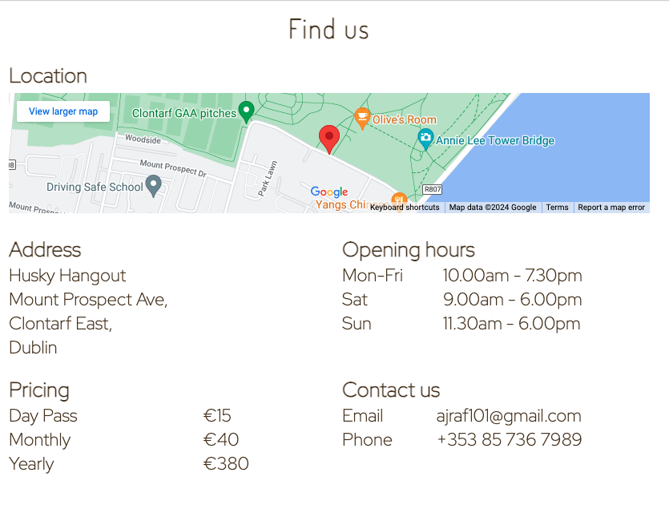

# Husky Hangout
Website author: Andrew Farrell.  
URL: https://ajraf101.github.io/husky_hangout

Welcome to Husky Hangout!  
Husky Hangout is dedicated to solving a common challenge faced by husky owners: managing the breed's incredible energy while promoting their socialization and training. Our unique platform introduces a specially designed space that caters exclusively to huskies, offering top-notch training programs and opportunities for social interaction with other dogs.

Husky Hangout targets husky owners who seek effective ways to channel their pet's energy constructively. Our mission is to help owners and their huskies lead fulfilling lives together through expert training, engaging activities, and ample space for exercise. Join Husky Hangout and discover the ultimate solution for all your husky's needs, ensuring a harmonious and happy relationship for both you and your furry friend.

# Features
A key feature of this site is its simplicity. It promotes easy navigation and is direct and to the point, serving as an introduction to a great option for husky owners. The site is not overloaded with information, making it easy for users to quickly understand its purpose. Visitors can easily find details about the location of the center, costs, contact information, and an intuitive sign-up section.
## Existing features
- Navigation bar. 
  - The Husky Hangout website features a streamlined navigation bar at the top, designed for ease of use on all devices. This bar includes links to the Logo, Home page, Find Us, and Sign Up page, and is consistent across the site to facilitate straightforward navigation. 
  - Users can effortlessly move between sections, ensuring a smooth and intuitive browsing experience.
  - For the mobile version, the navigation bar features a dropdown menu. This design reduces clutter while maintaining ease of navigation.

- __The Hero image__

  - Below the navigation bar, the site displays a prominent image of a person embracing their husky. The text overlay reveals the site’s name and features a slogan.
  - The selected image boasts an appealing color palette. These colors were extracted from the image to design the rest of the website, ensuring a cohesive visual experience from the initial view to the final sign-up stage.
  - The image has been carefully selected to ensure it works well on a responsive site, particularly for mobile devices.

. 

- What we're about section
  - With a minimalistic design blending imagery and text, this section promptly communicates the site's purpose and conveys the company's ethos to the user.
  - The second half delves deeper into what’s available at the Husky Hangout Center, following the initial brief introduction. This additional information is relevant because it provides users with a clearer understanding of the center's offerings and atmosphere.
  - The images depict huskies happily interacting with each other, while another image shows owners enjoying the space alongside their pets, highlighting the center's welcoming and community-focused environment.

. 

- Video section
  - As if the first section wasn't enough, a video is displayed to help the user see the benefits of the center for both them and their husky.
  - The caption "Still not convinced?" is provocative, encouraging the user to get involved by showcasing real-life interactions and positive experiences at the center

  

- The footer
  - The footer includes links to the club's social media pages, which open in a new tab, offering additional ways to contact the club and its members.
  

- Find us page
  - This page provides all the necessary information for users who want to engage further with the company, including the address, pricing, opening hours, and contact details.
  - A notable feature of this page is the interactive Google Maps location. Users can open the map in a separate tab, thanks to a custom API setup specifically for this site.

- Sign up page

  - Maintaining a minimal style, the sign-up page features a clear, easy-to-follow layout that is responsive to all screen sizes.
  - This page is intentionally placed last to guide the user through the site, ensuring they have read all about what the site offers before reaching the sign-up stage.

- Custom thank you page
  - After completing the sign-up process, the user is directed to a custom thank you page that encourages further engagement through social media.
  

- Custom 404 page
  - No site is complete without a custom 404 page. For users who accidentally navigate away or enter the URL incorrectly, a custom 404 page has been designed to redirect them back to the main site seamlessly.

## Features left to implement

- Testing
Throughout the development of this website, regular testing was a priority. Each modification was promptly verified using the Gitpod external server, ensuring the website remained up-to-date and functional. Testing was conducted on a variety of devices, including a 13" MacBook Pro, an iPad Air 2, and an iPhone 12 pro, to guarantee compatibility. Several browsers, such as Chrome, Safari, and Firefox, were utilized during these testing phases.

Interactive elements underwent rigorous testing across all devices to confirm their functionality on different platforms. For instance, the main logo was tested to ensure it reloaded the index.html page correctly, and each navigation bar button was checked to ensure it directed users to the appropriate sections of the site.

The video component was also thoroughly tested on each device, with all controls verified for proper operation. Additionally, the sign-up form was tested to ensure the link opened in a new tab, as intended. The social media icons followed a similar testing protocol, confirming that each one opened in a new tab.

Further testing was conducted by external users. A link to the website was distributed to a list of users who tested it on their own devices. Feedback from these users indicated that the website functioned without any issues.

- Validator Testing
  - HTML: The official [W3C validator](https://validator.w3.org/) was used to check the HTML code, and no errors were detected.
  - CSS:The CSS code was validated using the official [Jigsaw validator](https://jigsaw.w3.org/css-validator/), which also reported no errors.
  - There was consideration placing the CSS certificate at the bottom of the site, but decided against it as it deteracted from the minimalist style of the page.

## Unfixed bugs

## Deployment

## Credits

## Other general project advise

# DELETE BELOW THIS LINE BEFORE SUBMISSION

I cropped the hero image as the original was in portrait. When it comes to mobile this would have worked fine but thinking of the browser width that would later come on a computer I decided to have the prepared. I chose this image for its colours and designed the rest of the site with these colours in mind as to keep a consistant theme throughout. 
As it turns out testing of the first image proved that it would not fit neatly across all platforms. As a result a new image was chosen. Sadly this wasted some time as the site until this point had been working towards this colour scheme. Luckily though there were not to many changes to make and a more suitable image was discovered.

**I should add in some sort of hero image effect like the one in boulder dash where the image slides into place**

**Make sure to pass the pages through the validaters**

**Insert screenshots of the finished project in the README**