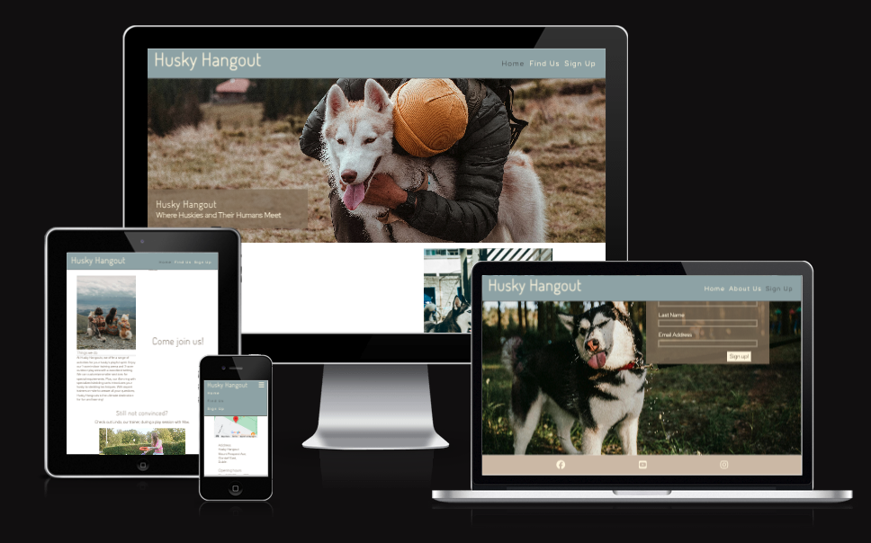
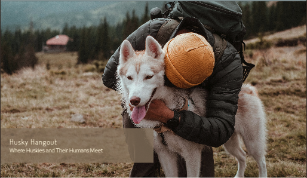
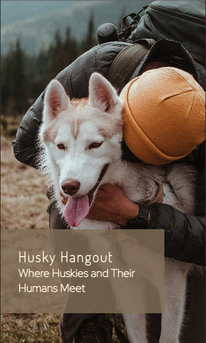
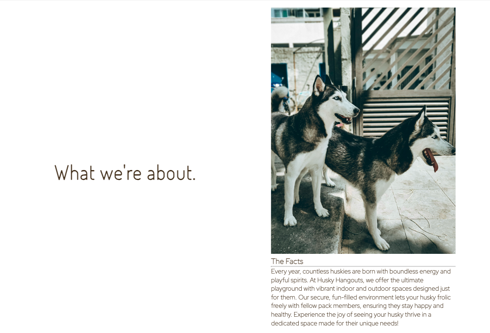
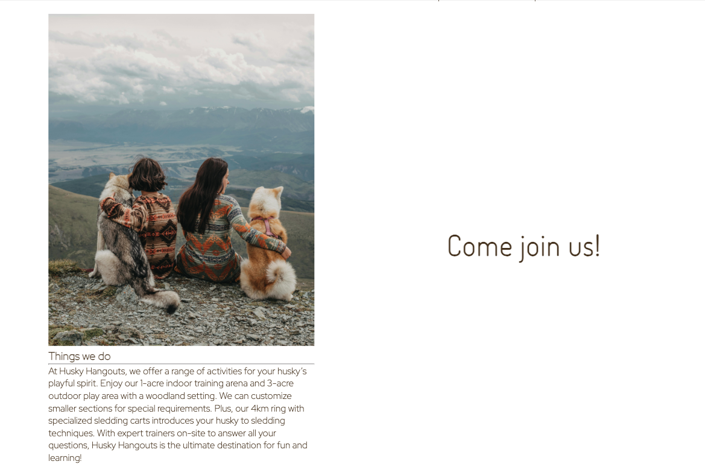
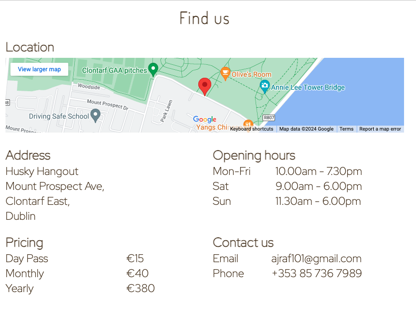
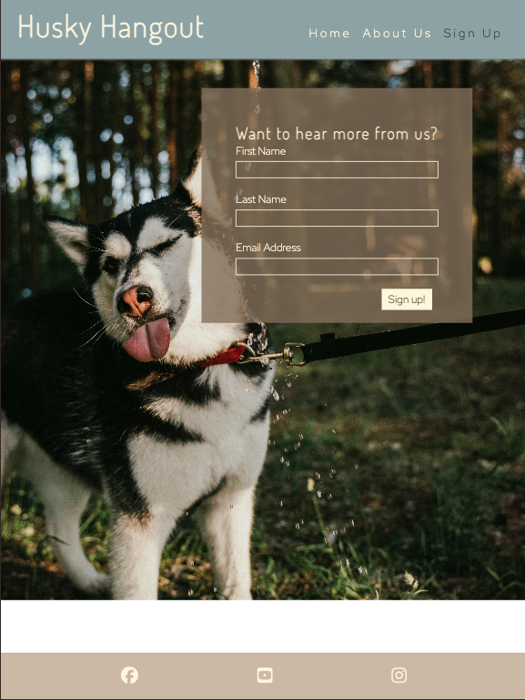
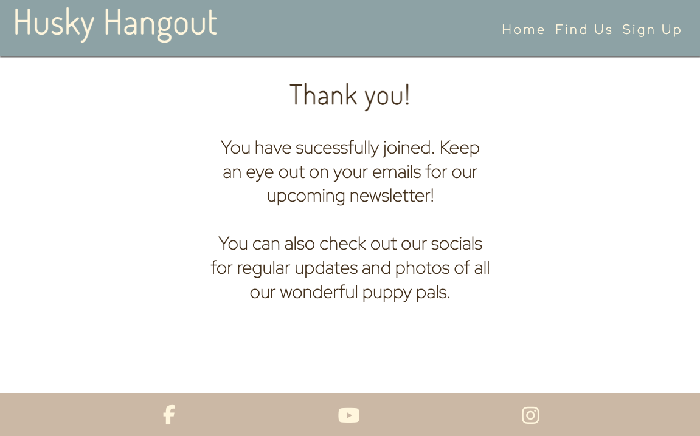
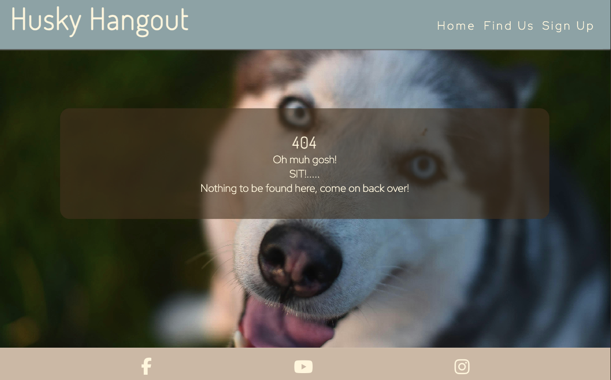

# Husky Hangout
Website author: Andrew Farrell.  
URL: https://ajraf101.github.io/husky_hangout

Welcome to Husky Hangout!  
Husky Hangout is dedicated to solving a common challenge faced by husky owners: managing the breed's incredible energy while promoting their socialization and training. Our unique platform introduces a specially designed space that caters exclusively to huskies, offering top-notch training programs and opportunities for social interaction with other dogs.

Husky Hangout targets husky owners who seek effective ways to channel their pet's energy constructively. Our mission is to help owners and their huskies lead fulfilling lives together through expert training, engaging activities, and ample space for exercise. Join Husky Hangout and discover the ultimate solution for all your husky's needs, ensuring a harmonious and happy relationship for both you and your furry friend.

# Features
A key feature of this site is its simplicity. It promotes easy navigation and is direct and to the point, serving as an introduction to a great option for husky owners. The site is not overloaded with information, making it easy for users to quickly understand its purpose. Visitors can easily find details about the location of the center, costs, contact information, and an intuitive sign-up section.
## Existing features
- Navigation bar. 
  - A streamlined navigation bar at the top, optimized for all devices, includes links to the Logo, Home, Find Us, and Sign Up pages. It ensures smooth and intuitive browsing. 
  - Users can effortlessly move between sections, ensuring a smooth and intuitive browsing experience.
  - For mobile users, a dropdown menu reduces clutter while maintaining ease of use.

- __The Hero image__

  - Below the navigation bar, a prominent image of a person with their husky showcases the site’s name and slogan. The appealing color palette from the image was used throughout the site for visual cohesion.
  - The image is responsive, ensuring a good experience on mobile devices.

. 

- What we're about section
  - A minimalistic design blends imagery and text to communicate the site's purpose and ethos effectively.
  - This section includes detailed information about what’s available at the Husky Hangout Center, enhancing user understanding.
  - The images depict huskies happily interacting with each other, while another image shows owners enjoying the space alongside their pets, highlighting the center's welcoming and community-focused environment.

. 

- Video section
  - As if the first section wasn't enough, a video is displayed to help the user see the benefits of the center for both them and their husky.
  - The caption "Still not convinced?" is provocative, encouraging the user to get involved by showcasing real-life interactions and positive experiences at the center

  

- The footer
  - The footer includes links to the club's social media pages, which open in a new tab, offering additional ways to contact the club and its members.
  

- Find us page
  - Provides essential information such as address, pricing, opening hours, and contact details, featuring an interactive Google Maps location with a custom API setup.

- Sign up page
  - Maintaining a minimal style, the sign-up page features a clear, easy-to-follow layout that is responsive to all screen sizes.
  - This page is intentionally placed last to guide the user through the site, ensuring they have read all about what the site offers before reaching the sign-up stage.

- Custom thank you page
  - Directs users to a thank you page post-signup, encouraging further engagement through social media.
  

- Custom 404 page
  - No site is complete without a custom 404 page. For users who accidentally navigate away or enter the URL incorrectly, a custom 404 page has been designed to redirect them back to the main site seamlessly.

- Features left to implement
  - Online Store: Add an online store selling husky-themed merchandise and pet supplies. This would also support the community.
  - Activity Booking System: Implement a system where users can book activities and events at the Husky Hangout Center directly through the site.

## Testing

Testing was a key priority throughout development. Each modification was verified using the Gitpod external server to ensure the site remained functional. Tests were conducted on various devices, including a 13" MacBook Pro, iPad Air 2, and iPhone 12 Pro, as well as browsers like Chrome, Safari, and Firefox.

Interactive elements were rigorously tested across devices. For example, the main logo’s reload functionality and the navigation bar’s accuracy were checked. The video component and sign-up form were tested to confirm proper operation, and social media icons were verified to open in new tabs.

External user testing also confirmed the website’s functionality across different devices.

- Validator Testing
  - HTML: The official [W3C validator](https://validator.w3.org/) was used to check the HTML code, and no errors were detected.
  - CSS:The CSS code was validated using the official [Jigsaw validator](https://jigsaw.w3.org/css-validator/), which also reported no errors.
  - There was consideration placing the CSS certificate at the bottom of the site, but decided against it as it deteracted from the minimalist style of the page.

    

## Deployment

This site was deployed using GitHub Pages. Although the code was written in Gitpod, which provides a preview window, it was important to deploy the site early to ensure that changes were being applied to the live site and not just the preview.

## Credits
A wide variety of resources were utilized in creating this site. Notable ones include Stack Overflow, ChatGPT, tutors and students from the Code Institute on Slack, and W3Schools. All images and videos were sourced from Pexels. Below is a list of all the resources used during the site's development.
  - Hero image color picker: https://imagecolorpicker.com/en
  - Styling with font awesome: https://fontawesome.com/docs/web/style/styling
  - Vertically align inside a flex box https://stackoverflow.com/questions/25311541/how-to-vertically-align-text-inside-a-flexbox
  - Add google maps location: https://developers.google.com/maps
  - image converter: https://cloudconvert.com/jpg-to-webp
  - image compression: https://tinypng.com/

## Content
- All content was generated for this site by the author.